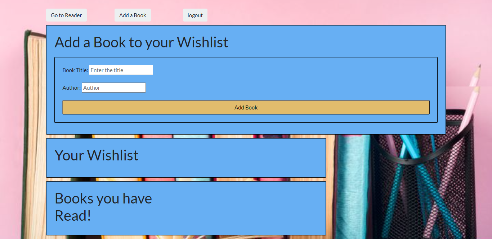

# Book Club

Book Club is an app that uses MySql to store users along with a list of books chosen by each user. The User saves this list to their unique username which is verified using Passport. When the users page loads the books are seperated into two list, a wishlist, and a read list. Books can be moved from the wishlist to the read list using a button generated for each book. Each user's page is dynamically generated using Handlebars for a unique rendering of their chosen booklist. This application is deployed using Heroku.

[Book Club](https://stormy-badlands-74908.herokuapp.com/)

 ## Table of Contents

  *[License](#license)

  *[Installation](#installation)

  *[Usage](#usage)

  *[Contribution](#contribution)

  *[Technologies](#technologies)

  *[Questions](#questions)

## License

## Installation

You will need to ensure you have the following dependencies:

`
npm i
npm install express
npm install express-handlebars
npm install mysql
npm install passport
npm install sequelize
`
## Usage

Once dependencies have been installed, you can run the application in the terminal with:

`
node server.js
`
This will allow you to run it locally, but it can also be used globally via the live link above!

## Technologies

Tools used:

*1. Passport
*2. Sequelize
*3. Mysql
*4. Handlebars.js
*5. Express
*6. Node.js
*7. JavaScript
*8. HTML
*9. CSS

## Contributors

This project was created with the help of our bootcamp class materials and teamwork. Our team was [Heath](mailto:heathw2444@yahoo.com), [Ivodia](mailto:ivodiainjoh@gmail.com), [Jessica](mailto:deck.jessica@gmail.com), and [Maria](mailto:mariaortegapb@gmail.com)

## Questions

For any questions, you can visit the [GitHub page](https://github.com/deck-jessica/book-club)